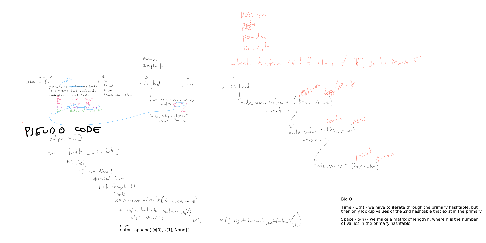

# Hashtable

## Challenge

Implement a hashtable:

* should have a `get('key')` method
* have a `set('key', value)` method

## efficiency

`set`/`get` times are 0(1), unless there is a collision, then its O(n) at that collision

`join` time is O(n), because we have to iterate through one table's entries.

## API

```python
# to instantiate a hashtable:
# size is 1024 by default
table = Hashtable(size)

# to set a key/value pair in the hashtable:
# key must be a string, value can be any type
table.set('key', value)

# to get a value using a key:
# key must be a string
value = table.get('key')

# to JOIN (like a sql JOIN) a hashtable
table.join(other_table)

# optionally you can join the other table against this one
table.join(other_table, right_join=True)
```

## join whiteboard


