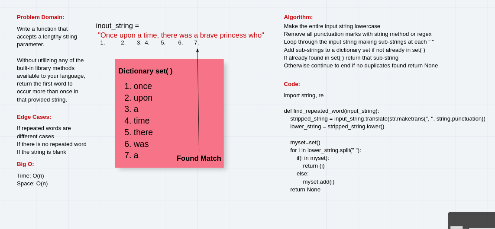

# Repeated Words

## Problem domain

Implement a method that returns the first repeated word in a given string

## whiteboard w/ Alex



## Implementation

I used regex to break the supplied string into a list of words, then loop through the list and add each word to a set if it doens't already exist in the set. If it does exist, return the word:

```pytthon
find_first_repeated_word(some_long_string)
```

I also implemented another similar method that uses a dictionary instead of a set, to keep a runninig total of each word and return that:

```python
count_words(some_long_string)
```
