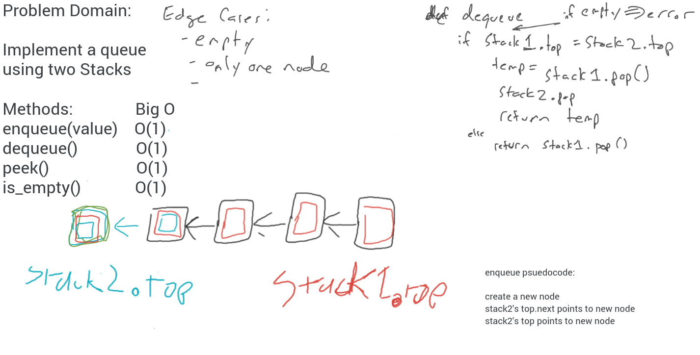

# Stacks and Queues

## Stack implementation

Method | Big O | What it does
------ | ----- | ------------
`peek()` | O(1) | will peek at top, return the value (error if empty stack)
`is_empty()` | O(1) | returns a boolean
`push(value)` | O(1) | create a new node, and put it at the top of the stack
`pop()` | O(1) | will remove the top node, return the value (error if empty stack)

## Queue Implementation

Method | Big O | What it does
------ | ----- | ------------
`peek()` | O(1) | will peek at front, return the value (error if empty stack)
`is_empty()` | O(1) | returns a boolean
`enqueue(value)` | O(1) | create a new Node with value, and assign it to the rear
`dequeue()` | O(1) | remove the front node, and reassign the front to the next node

## PsuedoQueue Implentation - Queue using two stacks

Method | Big O | What it does
------ | ----- | ------------
`peek()` | O(1) | will peek at front, return the value (error if empty stack)
`is_empty()` | O(1) | returns a boolean
`enqueue(value)` | O(1) | create a new Node with value, asssign it to rear_stack's top
`dequeue()` | O(1) | remove the front_stack's top and return the value

### whiteboard

