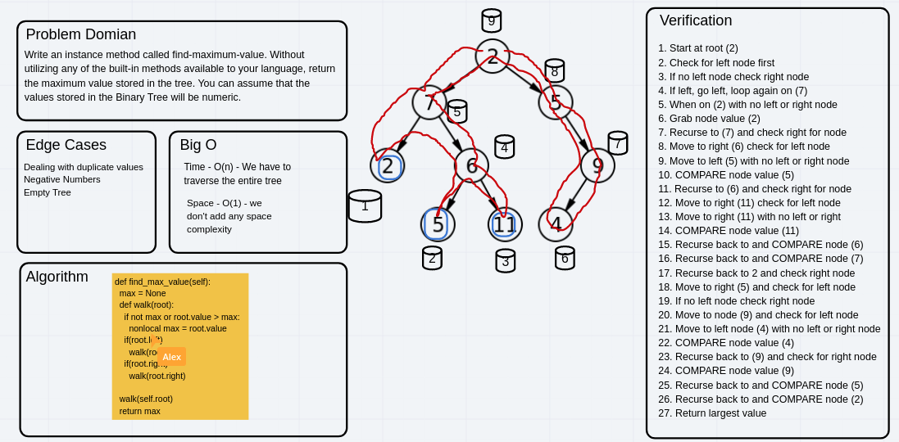
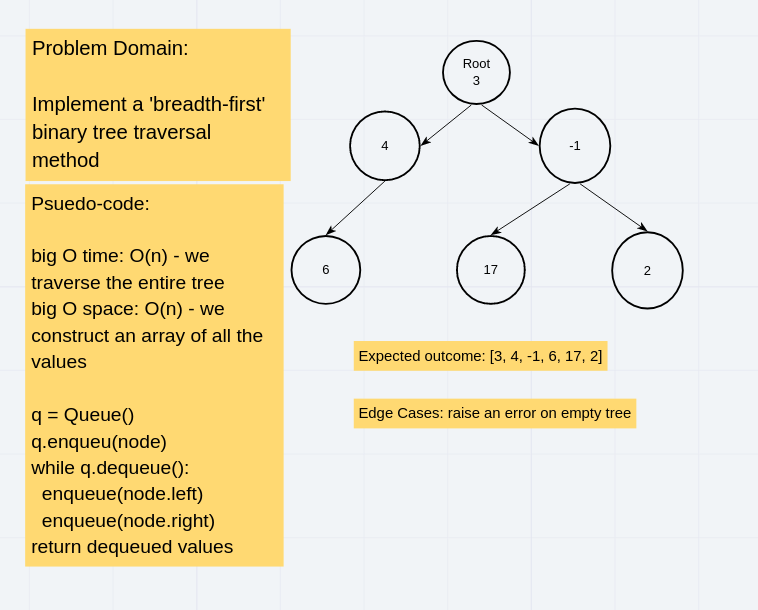
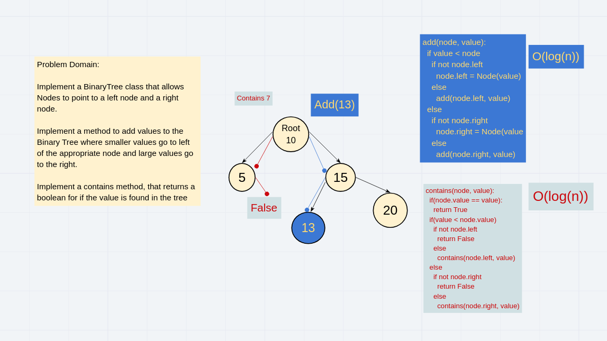
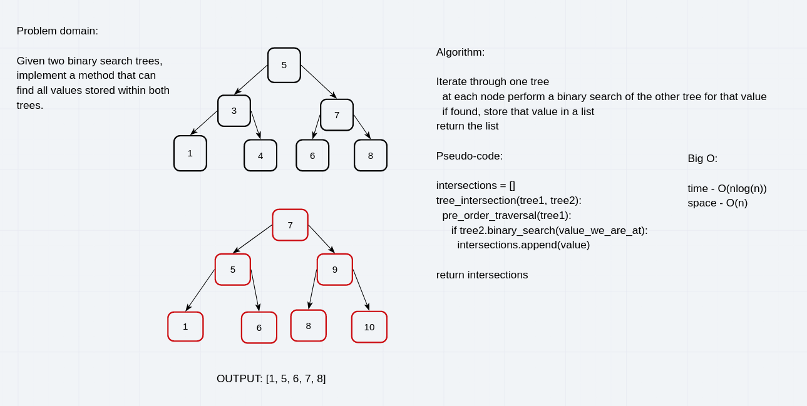

# Binary Tree

- [Binary Search Tree pull request](https://github.com/skrambelled/data-structures-and-algorithms/pull/30)
- [find_maximum_value() pull request](ttps://github.com/skrambelled/data-structures-and-algorithms/pull/31)
- [breadth first traversal](https://github.com/skrambelled/data-structures-and-algorithms/pull/33)

## Implementation

`Node` - holds a `value` and a pointer to a `left` node and a `right` node

`Tree` - holds a pointer to a `root` node

---

`BinaryTree` - Extends the `Tree` class

Method | Big O | What it does
------ | ----- | ------------
`add(value)` | log(n) | adds a node with value to the tree in the a psuedo random spot
`find_maximum_value()` | O(n) | searches through the whole tree recursively and return the max value encountered
`breadth-traverse` | O(n) | returns all the values held in the tree, in breadth-first order

---

`BinarySearchTree` - Extends the `BinaryTree` class

Method | Big O | What it does
------ | ----- | ------------
`add(value)` | log(n) | adds a node with value to the tree in the appropriate spot
`contains(value)` | log(n) | searches the tree recursively for value, and returns `True` or `False`
`pre_order()` | O(n) | returns a list of values with pre-order sorting
`in_order()` | O(n) | returns a list of values with in-order sorting
`post_order()` | O(n) | returns a list of values in post-order sorting
`tree_intersections(tree)` | O(nlog(n)) | returns a list of values that both the tree, and the other share

## Whiteboard

[<-- Back](../README.md)
